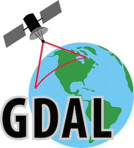
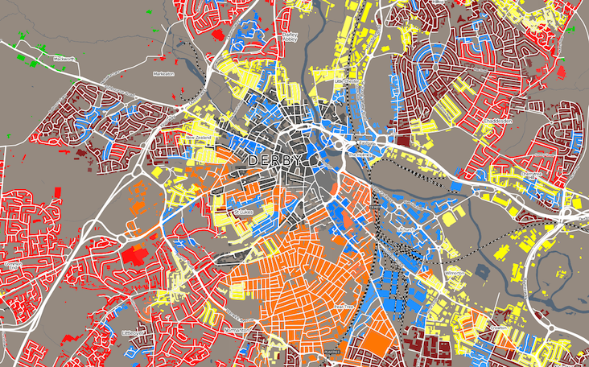
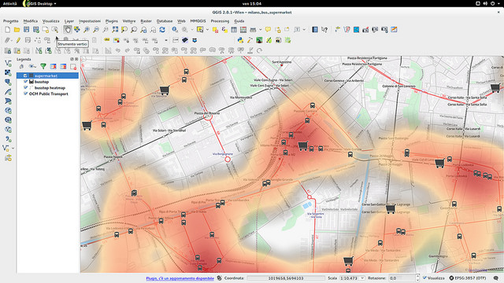

# Intro to geographic data

Geographic data is any dataset that has a location element to it - usually provided as latitude and longitude coordinates - that describes a set of points, lines, or polygons, or a picture (raster) with other non-geographic attributes attached to them. A lot of datasets fall under the category of geographic data (aka spatial data) - from bus stops, postcodes, and cycle paths to polling places, satellite or aerial photography, and mineral deposits.

Google Maps [may have popularised mapping](http://www.theguardian.com/technology/2015/feb/08/google-maps-10-anniversary-iphone-android-street-view), but actually working with the data that underlies a map requires some specialist tools and knowledge.

If you're new to working with spatial data then we **highly recommend** reading Tom MacWright's truly excellent [mapschool: a free introduction to geo](http://mapschool.io/) site. You can skim through it in about half an hour and get up to speed on the basics of spatial data, learn about the common data types, and likely pick up some knowledge that will save you a lot of frustration down the line.

# Quick and dirty - just show me what the data looks like

The first thing you'll probably want to do when you find data is to actually just quickly view it to see what it looks like, check if the data is what you thought it was, if the geographic distribution is about right, et cetera.

Well, there's a couple of options.

For really quick and simple viewing you can drop most common sorts of spatial vector data on [geojson.io](http://geojson.io/) and see a quick representation of it (as well as then exporting it back out to a different format). All of the processing is client-side though, so you might want to avoid giving it a huge or complex dataset. [MapStarter](http://mapstarter.com/) is another similar service, though it only allows you to export the data as an image (or a simple web map).

Oh - and did you know that GitHub [will render any GeoJSON files](https://help.github.com/articles/mapping-geojson-files-on-github/) that you commit to your repo. Fun!

For any larger or more complex datasets [QGIS](http://www.qgis.org) is a great open source cross-platform tool for viewing any and every type of spatial data.

# Converting between data formats

So you've found the dataset you want, but it's in some bizarre and possibly arcane format (Shapefiles, MapInfo TAB file - I'm looking at you! [on behalf of the entire spatial industry I apologise for these two formats still existing]) and you want to convert it to something more developer friendly and modern (e.g. GeoJSON, CSV, KML).

For small datasets (< 10mb) [MyGeoData](http://converter.mygeodata.eu/) will let you convert between most formats. For anything beyond 10mb you'll want to reach for the [GDAL](http://www.gdal.org/ "Geospatial Data Abstraction Library") command-line tools - GDAL is a fantastic open source project that has been embedded in a lot of the software in the spatial world. To translate vector data in GDAL reach for the [ogr2ogr](http://www.gdal.org/ogr2ogr.html) command (if you're on Windows [ogr2gui](http://www.ogr2gui.ca/en/index.php) is available too), for raster (picture) data [gdal_translate](http://www.gdal.org/gdal_translate.html) will convert almost anything to almost anything else.

If command-line tools aren't your thing skip down a bit to the section on QGIS for a cross-platform GUI built on, amongst other things, GDAL.

Oh - and there are GDAL bindings available for [Perl](http://trac.osgeo.org/gdal/wiki/GdalOgrInPerl), [Python](http://trac.osgeo.org/gdal/wiki/GdalOgrInPython), [Java](http://trac.osgeo.org/gdal/wiki/GdalOgrInJava), [C#/.NET](http://trac.osgeo.org/gdal/wiki/GdalOgrInCsharp), [Ruby](http://trac.osgeo.org/gdal/wiki/GdalOgrInRuby), and [R](http://trac.osgeo.org/gdal/wiki/GdalOgrInR). Scroll on down to the [Spatial analysis](#working-with-geographic-data-and-maps-analysis) section for more suggestions of libraries to use in your favourite language.

# Geocoding - turning an address into coordinates

Your geocoding needs will likely fall into one of two categories: Needing to geocode an address provided by the user vs needing to batch geocode a set of addresses in a dataset.

The School of Data has two great introductory posts [Geocoding Part 1: Introduction to Geocoding](http://schoolofdata.org/2013/02/19/geocoding-part-i-introduction-to-geocoding/) and [Geocoding Part 2: Geocoding Data in a Google Docs Spreadsheet](http://schoolofdata.org/2013/02/19/geocoding-part-ii-geocoding-data-in-a-google-docs-spreadsheet/).

In the former case, your quickest and easiest option is to make use of the [Google Geocoding API](https://developers.google.com/maps/documentation/geocoding/) built on top of Google Maps. Examples are available of a [simple geocoding call](https://developers.google.com/maps/documentation/javascript/examples/geocoding-simple) and an [address search with auto-complete functionality](https://developers.google.com/maps/documentation/javascript/examples/places-searchbox). Caveat emptor - the [Google Maps Terms of Service](https://developers.google.com/maps/terms) do require that the results of geocoding requests are displayed in some fashion on top of a Google Map and limits you to 2,500 requests/day.

There are some free / open source RESTful APIs for geocoding, which you could happily either wrap a UI around or issue batch requests to yourself. These include the [MapQuest Nominatim Search API](http://developer.mapquest.com/web/products/open/nominatim), the [MapBox Geocoding API](https://www.mapbox.com/developers/api/v3/geocoding/), and the [GeoNames Search API](http://www.geonames.org/export/web-services.html).

If you're after a more set-and-forget geocoding service that will geocode a whole file of addresses with having to fiddle with making your own API calls then take a look at [CartoDB's](http://docs.cartodb.com/cartodb-editor.html#geocoding-data) geocoding functionality - and [Google Fusion Tables](https://support.google.com/fusiontables/answer/1012281?hl=en) is still kicking around in "experimental" mode ([tutorial here](http://mdl.library.utoronto.ca/guides-help/geocoding-tutorial-using-google-fusion-tables)).

Lastly, the Python library [geopy](https://github.com/geopy/geopy) provides a convenient API wrapper around almost every geocoding service known to humanity.

# Analysis

Unless the spatial part of your project is only for window dressing you're probably going to need to do some analysis between it and other datasets. For instance - you might need to group one of your spatial datasets (like public transport usage) by another (like suburbs) to generate some summary statistics on usage.

You *could* hack together some code yourself to work it out, but really there are some far better and far far more powerful options available to you.

*Image from [spatia.ly](http://spatial.ly/2012/02/deceptive-in-their-beauty/)*

## PostGIS

[PostGIS](http://postgis.net/) is an extension for [PostgreSQL](http://www.postgresql.org/) providing spatial capabilities for both vector and raster data. In spatial database-land it is unequalled in the [sheer range of functions](http://postgis.net/docs/reference.html) it makes available, their ease of use, and speed (it's written in C).

Seriously, don't waste your time with any other database.

[Getting up and running is easy](http://postgis.net/install) on any platform, with installers available for Windows, `brew install` or [Postgres.app](http://postgresapp.com/) on OSX, and packages available for all of the major Linux distros. For those inclined to Docker there are [Dockerfiles available](https://registry.hub.docker.com/search?q=postgis&searchfield=).

If you need more than `psql` on the command-line, [pgAdmin](http://www.pgadmin.org/) is available across all operating systems (and often comes bundled with PostgreSQL anyway).

Oh - and [Amazon RDS for PostgreSQL](http://aws.amazon.com/rds/postgresql/) comes with PostGIS already installed if for some reason you need that level of scalability.

### MySQL? SQL Server? et al.

These are not the spatial databases you're looking for...

Ok, fine - **technically** you do have spatial functionality in some of the other popular databases.

[SQL Server](https://msdn.microsoft.com/en-us/library/bb964712.aspx), [MySQL](http://dev.mysql.com/doc/refman/5.0/en/spatial-extensions.html), [Azure SQL](http://www.sqlskills.com/blogs/bobb/azure-sql-database-v12-preview-spatial-fully-functional/), [GeoDB](https://github.com/jdeolive/geodb) or [HatBox](http://hatbox.sourceforge.net/derbyquickstart.html) for [H2](http://h2database.com/), [neo4j-spatial](https://github.com/neo4j-contrib/spatial) for neo4j, and [DynamoDB](https://aws.amazon.com/blogs/aws/new-geo-library-for-dynamodb/) all have spatial support of some kind.

Quite [a few words](http://stackoverflow.com/a/22576304) have [been written](http://www.bostongis.com/PrinterFriendly.aspx?content_name=sqlserver2008_postgis_mysql_compare) comparing [spatial databases](http://www.bostongis.com/PrinterFriendly.aspx?content_name=sqlserver2008r2_oracle11gr2_postgis15_compare), so you might want to take a look before committing yourself to one or another.

tl;dr Avoid MySQL for anything spatial!

## QGIS

PostGIS may give you the heavy lifting power to do analysis, but staring at database rows trying to make sense of your results can be made so much easier by visualising them. Enter [QGIS](http://www2.qgis.org/en/site/) - a free and open source cross-platform Geographic Information System with the ability to create, edit, visualise, analyse, and publish spatial information.

Thanks to being built on top of [GDAL](http://www.gdal.org/ "Geospatial Data Abstraction Library") (amongst others) QGIS is capable of reading and writing almost any format of spatial data that you can throw at it - including direct connections to PostGIS databases.

*Image from [pjhooker (Flickr)](https://www.flickr.com/photos/city-planner/16732124571/in/pool-2327386@N22), CC BY-SA 2.0*

## Language bindings: R (Arrr!), Python, .NET, Ruby, et al.

If you need to delve down into working with spatial data at the code-level you've got a really rich set of tools at your disposal.

### Python

It's not too much of an exaggeration to say that Python is **the** language for doing anything spatial. It has an incredibly rich array of good libraries - far too many to list here - for analysing and manipulating every kind of spatial data under the sun, as well as the means of connecting in to any flavour of spatial data store you care to throw at it.

For some general words on working with spatial data in Python check out [Manipulimization of whatchamacallems?](http://sgillies.net/blog/986/manipulimization-of-whatchamacallems/) and [GIS with Python, Shapely, and Fiona](http://www.macwright.org/2012/10/31/gis-with-python-shapely-fiona.html).

And even if Python isn't exactly your cup of tea it's still very much worth a look if it can fit anywhere in your workflow.

For working with vector data check out [Shapely](http://toblerity.org/shapely/manual.html) (manipulation and querying geometry), [Fiona](https://github.com/Toblerity/Fiona) (a Python API into GDAL/OGR), [pysal](http://pysal.readthedocs.org/en/latest/) (for spatial analysis).

On the raster side of the equation head straight to [Rasterio](https://github.com/sgillies/rasterio).

Honourary mentions to [pandas](http://pandas.pydata.org/) (if you need to munge and otherwise play with GeoJSON or CSV files), and [cartopy](http://scitools.org.uk/cartopy/documentation.html) and [nodebox-opengl](http://www.cityinabottle.org/nodebox/) if you need to make pretty pictures or animations.

There's a more complete list of a bunch of other great Python spatial libraries [over here](http://spatialdemography.org/essential-python-geospatial-libraries/) that's well worth a read.

We should mention - pretty much anything you can do here you can also achieve with the tools available in a GUI in an application like QGIS.

### Java

Ok, so we may have exaggerated Python being the only awesome language for spatial data. Java is almost equally as awesome as Python, with a similarly rich ecosystem of libraries and applications ([GeoServer](http://geoserver.org/) the popular spatial data server is primarily Java-based).

For playing with vectors cast your eyes over [Spatial4j](https://github.com/spatial4j/spatial4j) (general purpose geospatial data library), [JTS (Java Topology Suite)](http://www.vividsolutions.com/jts/JTSHome.htm) (do things with geometry!), or [Apache SIS](http://sis.apache.org/)

For everything and anything check out [GeoTools](http://geotools.org/) - the Swiss Army Knife of spatial in Java-land for reading/querying/analysing/rendering vector and raster spatial data.

### R (Arrr!)

As a primer you should check out [Starting Analysis and Visualisation of Spatial Data with R](http://www.r-bloggers.com/starting-analysis-and-visualisation-of-spatial-data-with-r/).

Surprise! There's actually a great StackExchange question [on this very topic](http://gis.stackexchange.com/questions/45327/tutorials-to-handle-spatial-data-in-r). In addition to the resources listed therein, James Chesire has a great (and quite accessible) write-up on his blog at [R Spatial Tips](http://spatial.ly/r/). Robin Edwards also has some great words and examples about [3D Mapping in R](http://www.r-bloggers.com/3d-mapping-in-r/).

And there's also [spatstat](http://spatstat.github.io/) if you want to delve down into spatial statistics and analysis.

### .NET

You'll find pretty reasonable support for spatial data in .NET-land with the likes of:

[Geo](https://github.com/sibartlett/Geo) - a powerful little .NET 4.0+ library for querying and manipulating vector data.

[NetTopologySuite](https://github.com/NetTopologySuite/NetTopologySuite) - a port of the aforementioned popular JTS (Java Topology Suite) library for querying and analysing vector data.

[SharpMap](https://sharpmap.codeplex.com/) - a geo app framework for vector and raster data that includes its own rendering engine.

[MapWindow](http://www.mapwindow.org/) - an all in one desktop GIS tool + an ActiveX control for mapping + a C# library for handling vector data.

### Ruby

Your options are not quite as rich here - but have a look at [geokit](https://github.com/geokit/geokit), [georuby](https://github.com/nofxx/georuby/), and [RGeo](https://github.com/rgeo/rgeo).

Daniel Azuma's series of blog posts on doing [geospatial in Ruby](http://daniel-azuma.com/articles/georails) is going to be worth your time.

## A few other tools

In recent times a few really handy and modern little web tools have popped up for doing simple and/or common tasks with spatial data.

[geojson.io](http://geojson.io/) for quickly and easily creating, viewing, and sharing vector data as GeoJSON (and other common formats).

[Ogre](http://ogre.adc4gis.com/) as a web client to the ogr2ogr utility in GDAL. Easily convert between vector formats!

[GIS Convert](https://www.gisconvert.com/) for easily converting between spatial and spatial-like formats.

[GeoGig](http://geogig.org/) if you want to apply the principles of Git to spatial data.

[epsg.io](http://epsg.io/) if you've found some data but it's not in a standard projection (e.g. latitude and longitude, web mercator) then find the "EPSG" code and stick it in here to find out more about it.

[GitSpatial](https://github.com/JasonSanford/gitspatial) if you just want to wrap a spatial API around your GitHub-hosted GeoJSON data.

[TopoJSON](https://github.com/mbostock/topojson) an extension for GeoJSON that encodes topology tl;dr it'll make your GeoJSON up to 80% smaller.

And an honourary mention to [Shape2Earth](http://shape2earthengine.com/shape2earth/Home.html) for allowing the easy creation of maps for Google Earth.
